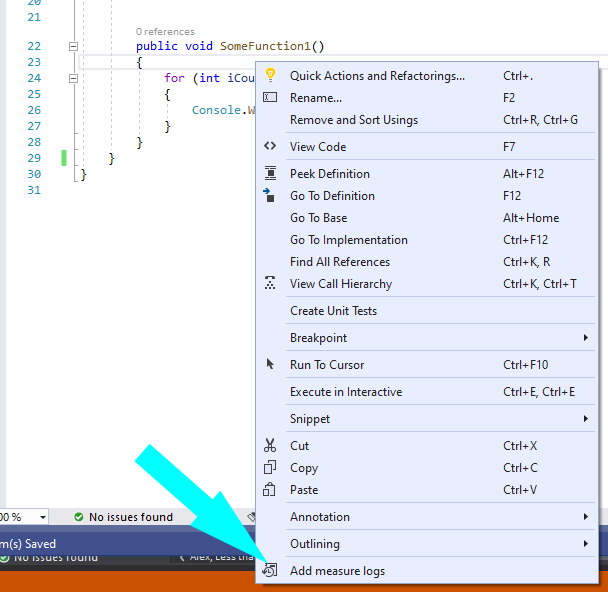
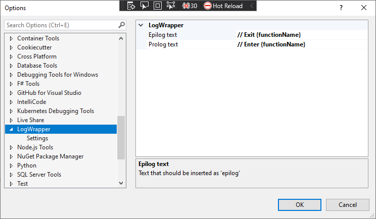

# LogWrapper Command
Visual Studio extension that add log call in the beginning and the end of selected function.

For example:

```csharp
public void SomeFunction1()
{
    for (int iCounter = 0; iCounter < 10; iCounter++)
    {
        Console.WriteLine(iCounter);
    }
}
```

will be changed to

```csharp
public void SomeFunction1()
{
    prolog
    for (int iCounter = 0; iCounter < 10; iCounter++)
    {
        Console.WriteLine(iCounter);
    }
    epilog
}
```

Please note that those two line `prolog` and `epilog` was dynamically inserted. 

### How it works

1. Clone solution
2. Compile and install VSix extension into Visual Studio
3. Once extension installed just right mouse click inside a function and select `Add measure logs`




You could change the text in `prolog` and `epilog` in `Tools` -> `Options` dialog:



text typed as `{functionName}` will be replaced by actual function name at run time


### The motivation sources


1. Visual Studio Extensibility Development book
2. Most of the coded was borrowed from: [mmahulea/FactonExtensionPackage](https://github.com/mmahulea/FactonExtensionPackage). Thank you !

That's all

Please note that this is an example code - just to show how it is done. Don't expect too much from it. May be buggy 

:wink: :thumbsup: